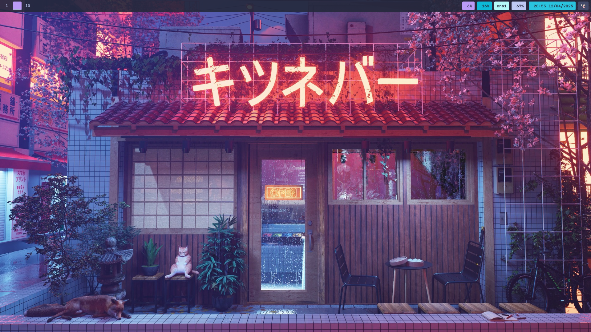

# 🚀 NixOS Configuration

A customized NixOS setup featuring Sway window manager, with separate configurations for desktop and laptop devices.



## 📋 Overview

This repository contains my personal NixOS setup with the following core components:

- **OS**: NixOS with flake support
- **Window Manager**: SwayWM (Wayland)
- **Terminal**: Ghostty
- **Editor**: Neovim (modified version of LazyVim)
- **Theme Engine**: Stylix for consistent system-wide styling
- **Shell**: Fish
- **File Manager**: Yazi (TUI) and Dolphin (GUI)

## 🏗️ Structure

The repository is organized as follows:

```
.
├── flake.nix                 # Main flake configuration
├── flake.lock                # Dependency lock file
├── hosts/                    # Host-specific configurations
│   ├── nixos/                # Desktop configuration
│   └── laptop/               # Laptop configuration
├── home/                     # Home-manager configurations
│   ├── simpa/                # Desktop user configuration
│   └── simpa-laptop/         # Laptop user configuration
│       └── modules/          # Configuration modules
│           ├── fish/         # Fish shell configuration
│           ├── nvim/         # Neovim configuration
│           ├── sway/         # Sway window manager configuration
│           ├── waybar/       # Waybar configuration
│           └── tmux/         # Tmux configuration
├── nvim/                     # Neovim config (LazyVim based)
└── ghostty/                  # Ghostty terminal configuration
```

## 🛠️ Setup Features

### System Configuration

- **Flakes**: Uses Nix flakes for reproducible builds and easier management
- **Home Manager**: Manages user environment and dotfiles
- **Stylix**: Provides consistent theming across the system using a Tokyo Night-inspired color scheme

### Desktop Environment

- **Sway**: i3-compatible Wayland compositor
- **Waybar**: Highly customizable status bar
- **Wofi**: Application launcher
- **Ghostty**: Modern, GPU-accelerated terminal emulator with split views support

### Development Tools

- **Neovim**: Customized with LazyVim distribution and many plugins
  - LSP support for various languages
  - Treesitter for improved syntax highlighting
  - Git integration with Neogit
  - File exploration with Oil.nvim
  - Rust, Go, and TypeScript support
- **Tmux**: Terminal multiplexer with `sesh` for session management
- **Fish**: Modern shell with custom aliases and integrations

### Applications

- **Browser**: Vivaldi
- **File Managers**: 
  - Yazi (TUI)
  - Dolphin (GUI)
- **Development**: Support for multiple languages including Rust, Go, and Node.js
- **Gaming**: Steam, Lutris, and ProtonUp for Windows game compatibility

## 📥 Installation

To install this configuration on a new system:

1. Install NixOS with a basic configuration
2. Clone this repository:
   ```bash
   git clone https://github.com/yourusername/nixos.git ~/nixos
   ```
3. **Important:** Modify the hostname in the configuration to match your system's hostname:
   - Edit `flake.nix` to change the hostname in `nixosConfigurations`
   - Update relevant files in `hosts/` directory to match your system

4. For desktop:
   ```bash
   sudo nixos-rebuild switch --flake ~/nixos#nixos
   ```
   
   For laptop:
   ```bash
   sudo nixos-rebuild switch --flake ~/nixos#laptop
   ```

> **Note:** The `#nixos` and `#laptop` in the commands above refer to the hostname configurations defined in your flake.nix. Make sure they match the hostnames you've set in your configuration.

## 🔄 Updating

### System Updates

Update the flake inputs:
```bash
nix flake update ~/nixos
```

Apply the updated configuration:
```bash
# For desktop
sudo nixos-rebuild switch --flake ~/nixos#nixos

# For laptop
sudo nixos-rebuild switch --flake ~/nixos#laptop
```

### User Config Updates

After modifying home-manager configurations:
```bash
home-manager switch
```

### System Cleanup

Remove old generations and free up disk space:
```bash
sudo nix-collect-garbage -d
```

## ⚙️ Customization

### Theme

The system uses Stylix with a Tokyo Night-inspired color scheme. The theme can be modified in the host configuration files:

```nix
stylix = {
  enable = true;
  base16Scheme = {
    base00 = "#24283B"; # Background
    base01 = "#16161E"; # Darker background
    # ...other colors...
  };
};
```

### Fish Shell

Custom fish configurations, including aliases, abbreviations, and functions are defined in:
- `home/simpa/modules/fish/default.nix` (Desktop)
- `home/simpa-laptop/modules/fish/default.nix` (Laptop)

Common aliases include:
- `rebuild`: Rebuild NixOS configuration
- `hms`: Apply home-manager changes
- `update`: Update flake inputs
- `cleanup`: Clean up old generations
- `lg`: Launch lazygit
- `y`: Launch yazi file manager

### Sway Window Manager

Sway configuration is defined in:
- `home/simpa/modules/sway/default.nix` (Desktop)
- `home/simpa-laptop/modules/sway/default.nix` (Laptop)

Key bindings:
- `Super+Return`: Open terminal
- `Super+q`: Kill active window
- `Super+a`: Open application launcher
- `Super+e`: Open file manager
- `Super+f`: Open browser
- `Super+h/j/k/l`: Move focus
- `Super+Shift+h/j/k/l`: Move windows
- `Super+1-0`: Switch to workspace
- `Super+Shift+1-0`: Move window to workspace
- `Super+p`: Screenshot selection to clipboard
- `Super+Shift+p`: Screenshot full screen to clipboard

## 🔌 Additional Components

### Ghostty Terminal

Custom configuration in `ghostty/config` with features:
- Tokyo Night Storm theme
- JetBrains Mono font
- Fish shell integration
- Background opacity for transparency
- Custom keybindings for split management

### Neovim Setup

A customized version of LazyVim with numerous plugins for development:
- LSP support with numerous language servers
- Oil.nvim for file navigation
- Treesitter for syntax highlighting
- Git integration with Neogit and Diffview
- Completion with nvim-cmp and Tabnine
- Debugging with DAP
- Harpoon for quick file navigation
- Mini.nvim plugins for additional functionality

### Tmux Configuration

Tmux is configured with:
- `Ctrl+a` prefix
- Integration with `sesh` for session management
- FZF for fuzzy finding
- Custom session switching with `T` key

## 🛂 Common Tasks

### Adding New Software

To add a new package system-wide, modify the appropriate host configuration file:
```nix
environment.systemPackages = with pkgs; [
  # Add your package here
  newpackage
];
```

For user-specific packages, add to home-manager configuration:
```nix
home.packages = with pkgs; [
  # Add your package here
  newpackage
];
```

### Adding a New Module

1. Create a new directory in `home/simpa/modules/` or `home/simpa-laptop/modules/`
2. Add a `default.nix` file with your configuration
3. Import the module in `home/simpa/home.nix` or `home/simpa-laptop/home.nix`

## 🔗 Useful Resources

- [NixOS Manual](https://nixos.org/manual/nixos/stable/)
- [Home Manager Manual](https://nix-community.github.io/home-manager/)
- [Sway Wiki](https://github.com/swaywm/sway/wiki)
- [LazyVim Documentation](https://lazyvim.github.io/installation)
- [Nix Flakes Wiki](https://nixos.wiki/wiki/Flakes)
